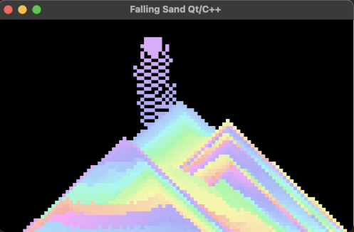

# Falling Sand Qt/C++
An interesting graphical effect written in Qt/C++. It is based on this [project](https://thecodingtrain.com/challenges/180-falling-sand).

## Screenshot



### Installing
A step by step series  that tell you how to get a execute project.
Get it from GitHub
```
git clone git@github.com:Przemekkkth/falling-sand-qt.git
```
Compile
```
qmake && make
```

## Addons
* [Qt](https://www.qt.io/) - Cross-Platform software for embedded & desktop
